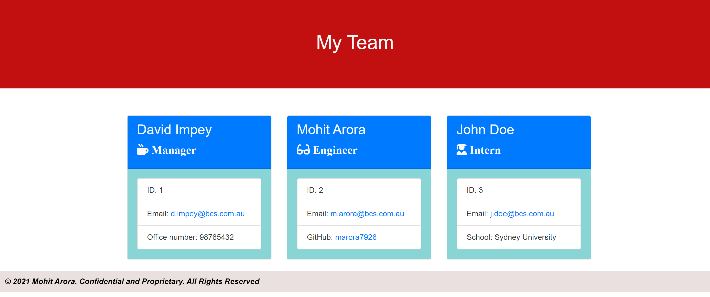

# team-profile-generator

## Your Task

Node.js command-line application that takes in information about employees on a software engineering team, then generates an HTML webpage that displays summaries for each tema member details.

## User Story

```md
AS A manager
I WANT to generate a webpage that displays my team's basic info
SO THAT I have quick access to their emails and GitHub profiles
```

## Acceptance Criteria

```md
GIVEN a command-line application that accepts user input
WHEN I am prompted for my team members and their information
THEN an HTML file is generated that displays a nicely formatted team roster based on user input
WHEN I click on an email address in the HTML
THEN my default email program opens and populates the TO field of the email with the address
WHEN I click on the GitHub username
THEN that GitHub profile opens in a new tab
WHEN I start the application
THEN I am prompted to enter the team manager’s name, employee ID, email address, and office number
WHEN I enter the team manager’s name, employee ID, email address, and office number
THEN I am presented with a menu with the option to add an engineer or an intern or to finish building my team
WHEN I select the engineer option
THEN I am prompted to enter the engineer’s name, ID, email, and GitHub username, and I am taken back to the menu
WHEN I select the intern option
THEN I am prompted to enter the intern’s name, ID, email, and school, and I am taken back to the menu
WHEN I decide to finish building my team
THEN I exit the application, and the HTML is generated
```

## Technologies used 

  1. HTML, CSS and Bootstrap
  2. Node.js
  3. NPM
  4. fs
  5. [Inquirer](https://www.npmjs.com/package/inquirer)
  6. [Jest](https://www.npmjs.com/package/jest)


## Repository Link
https://github.com/marora7926/team-profile-generator


## Screenshot - Generate HTML page


## Access a sample generated HTML file here
[Sample generated HTML FIle](https://cloudstor.aarnet.edu.au/plus/s/PAOzWLkIpHzEjM8)

## Access Walkthrough Video here
[Team Profile Generator Walkthrough Video](https://cloudstor.aarnet.edu.au/plus/s/Kc02EkdKAJxQvH0)

---
© 2021 Mohit Arora. All Rights Reserved.